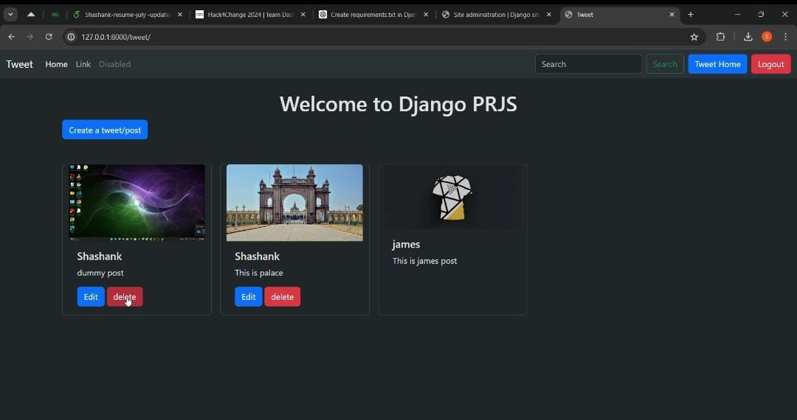

---
# Shashank Portfolio
---
## Welcome to shashank portfolio
[resume link](https://drive.google.com/file/d/1nlppqxLMOSRFlP9P5mocwxOAfqXUbHTi/view?usp=sharing)

## Project 1

_AwwazSpace_ - a web application with a responsive frontend using HTML, Bootstrap, and CSS for key views such as home, post creation, and login. The backend was built using Django's model-view-template (MVT) architecture, enabling efficient CRUD operations. I implemented user registration, login, and logout features with Django’s built-in authentication system. Additionally, I integrated secure payment processing via the Stripe API and containerized the entire application using Docker for easy deployment and scalability.
[github link](https://github.com/ShashankPatil35/AwaazSpace)

## Project 2
I built Hired, a job portal platform, using a ReactJS frontend styled with Shadcn UI and Tailwind CSS for a sleek, responsive design. The backend is powered by Supabase, handling data management and server-side functionality. For secure user authentication and management, I integrated Clerk, ensuring a smooth and seamless experience. Input validation was streamlined with Zod, significantly reducing errors. Finally, I deployed the platform on Vercel for fast and reliable performance. The entire project is hosted on GitHub for easy access and collaboration.  
[github link](https://github.com/ShashankPatil35/hired-job-portal)

## Project 3

I simulated the movement of _delivery personnel by using Apache Kafka_ producers to generate GPS data and Kafka consumers to process real-time location updates. The integration of the Confluent Kafka library with a Django backend allowed for efficient data flow, enabling real-time performance. GPS data was generated in JSON format through Kafka topics, facilitating live tracking on maps via the Maps API. To ensure seamless coordination and reliable handling of location updates, I leveraged Zookeeper for Kafka management.
[github link](https://github.com/ShashankPatil35/Delivery-tracking-system-)

